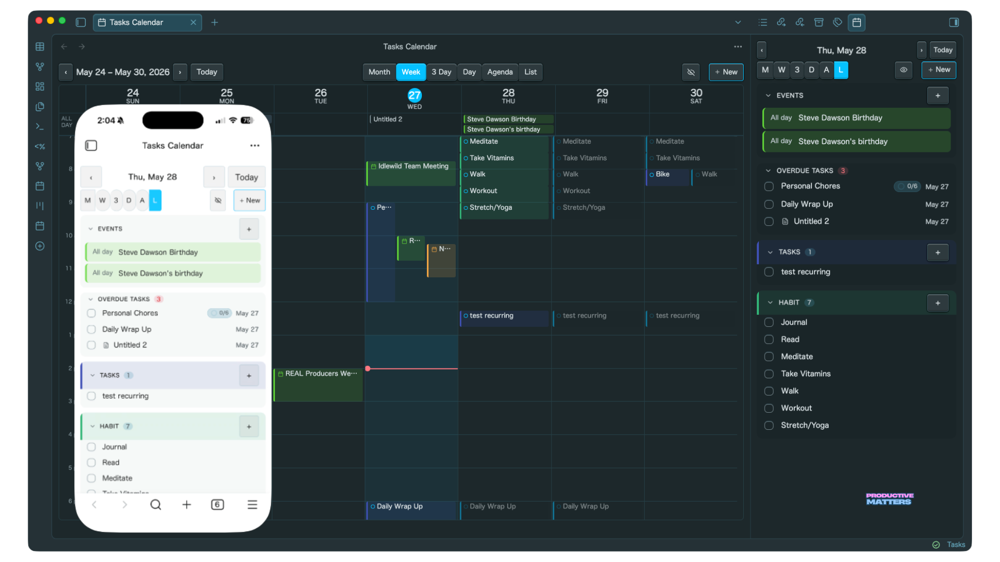

Obsidian Task Manager Plugin

Manage Tasks in Obsidian with ease and integrate with Google Calendar for full task and event management. Keep your tasks and events local and private, but sync them to your Google Calendar for easy access and notifications. Your tasks and events are synced in real-time.

NOTE: I built this tool for my personal needs and it's 100% vibe coded. I am sharing the plugin with the community in hopes that it will be useful to others.

If you love using Obsidian Task Plugin, consider supporting the development by [Buying me a coffee](https://buymeacoffee.com/antoneheyward).

You can also find me at [ProductiveMatters.com](https://productivematters.com)

## Installation

Step 1: Install BRAT

1. Open Obsidian and go to **Settings** > **Community plugins**.
2. Click **Turn on community plugins** (and ensure **Restricted mode** is disabled).
3. Click **Browse** and search for **"BRAT"**.
4. Click **Install** and then **Enable**. 

Step 2: Install a Obsidian Task Manager Plugin

1. Get the GitHub repository URL: https://github.com/antoneheyward/obsidian-task-manager
2. Go to Obsidian **Settings** and scroll down to the **BRAT** section in your sidebar.
3. Click **Add Beta plugin**.
4. Paste the copied GitHub link, select the latest version, and click **Add Plugin**.
5. Go back to **Settings** > **Community plugins**, scroll down to find the newly installed plugin, and make sure it's **Toggled On**
6. Watch this video if you need instruction on how to setup Google Calendar integration. [Configure integration with Google Calendar](https://youtu.be/BW2TJp9wV9k)

## Demo

